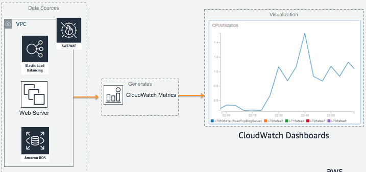
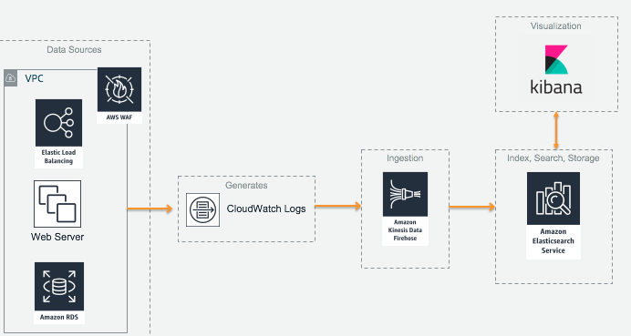
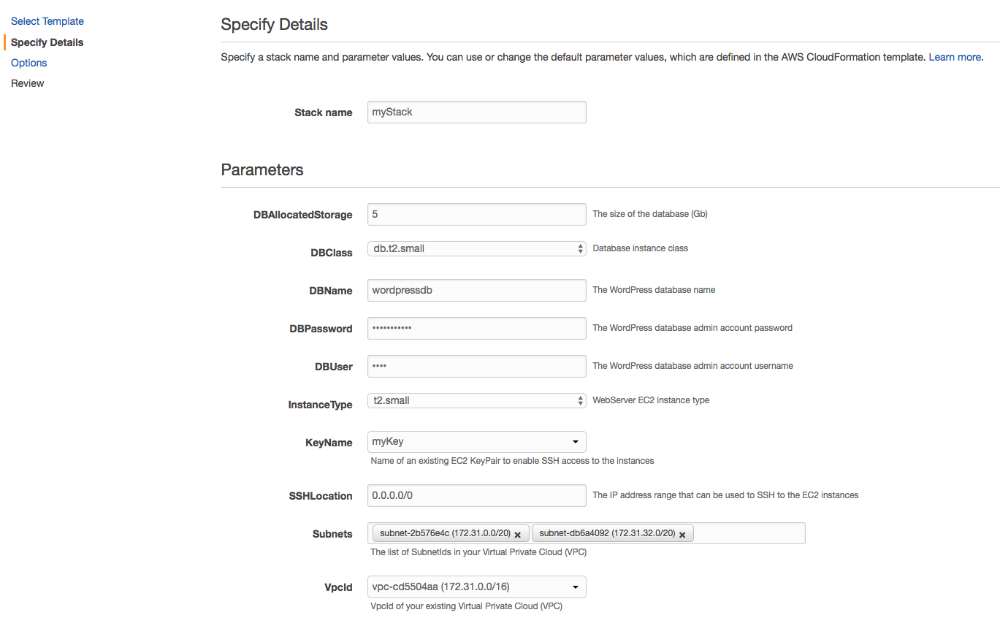
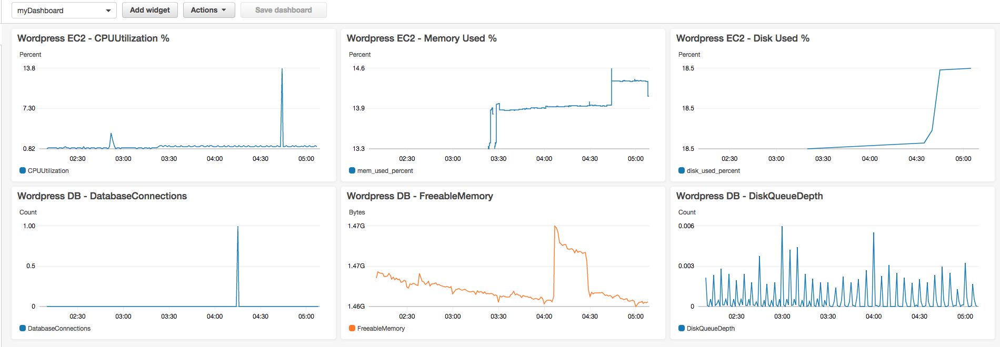
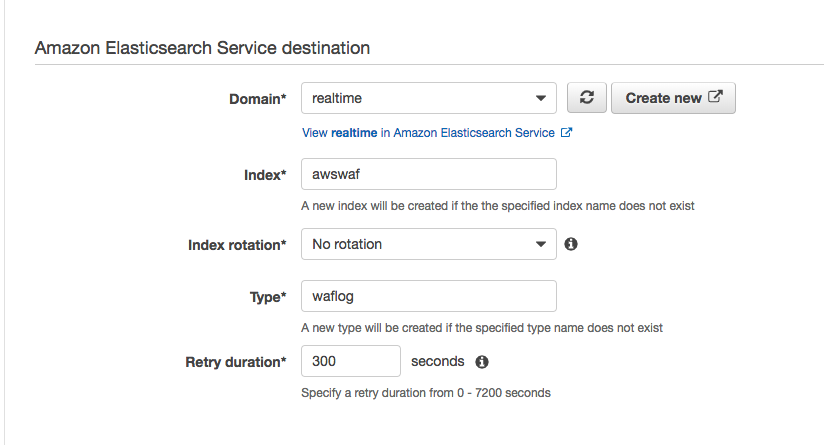
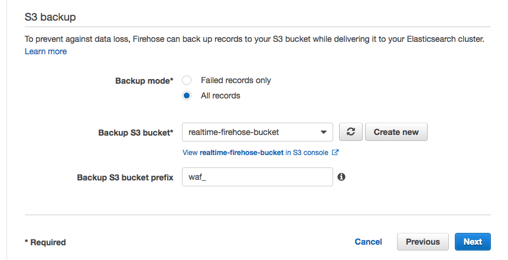
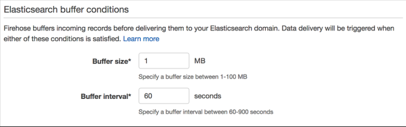
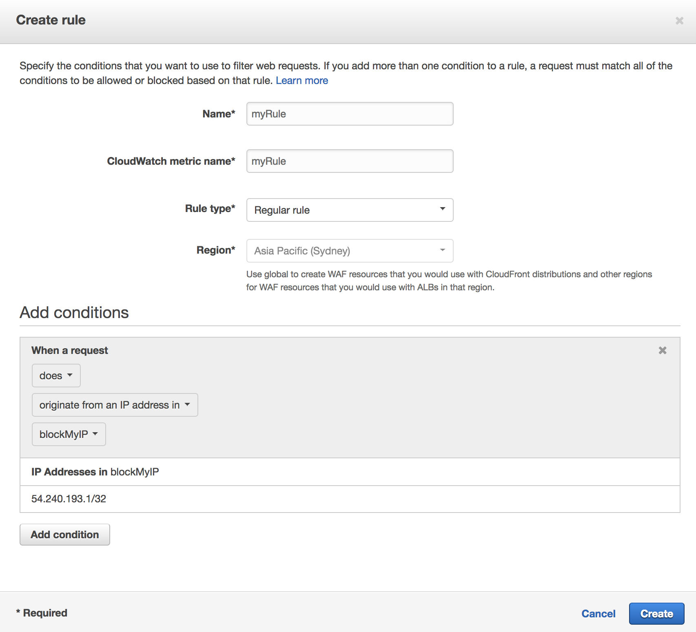
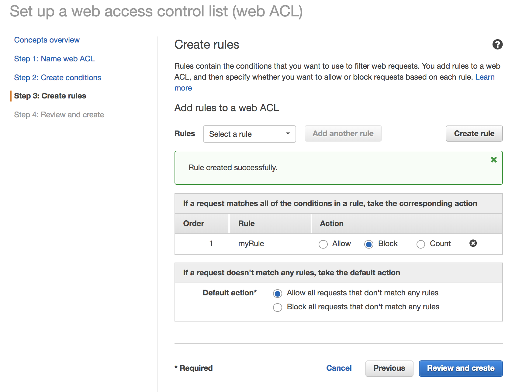
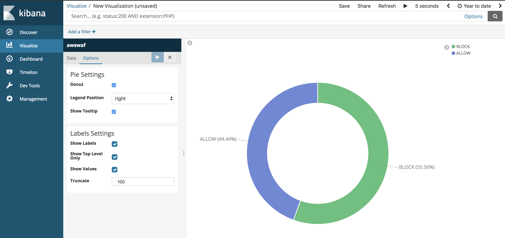

# Module 1: Monitoring for Operations

# Introduction
In the first part of this module, we will create a monitoring dashboard to gain visibility into the operational health of our infrastructure for EC2 and RDS instance. By surfacing these metrics, we can detect potential problems earlier on to spot capacity failures, and gain insights on demand pattern for time series analysis and cost savings through elasticity.

In the second part of this module, we will use AWS WAF on our Application Load Balancer to log incoming HTTP requests and use a ruleset to observe BLOCKED and ALLOWED requests in Kibana and Elasticsearch. 

By implementing a robust infrastructure monitoring solution, we can be better prepared for scaling our environment in the event of a traffic surge and make better long term decisions for capacity planning.

# Architecture

#### Monitoring Infrastructure through CloudWatch Metrics and Dashboards

#### Monitoring web requests through AWS WAF


# Region
This workshop will use the Sydney region, but you can also use the following regions.

+ US East (N. Virginia) us-east-1
+ US West (Oregon) us-west-2
+ Asia Pacific (Sydney)	ap-southeast-2
+ EU (Frankfurt) eu-central-1

# Creating a Wordpress Web App Environment
For our working environment, we will use a 2-tier Wordpress LAMP stack running on EC2 and MySQL on Amazon RDS. The EC2 instance is created with an IAM role attached, and bootstrapped with the SSM agent installed in user-data.
A CloudFormation template has been provided for this workshop, which will automatically create this environment for the labs. As it takes about 10-12 min to create the stack, feel free to view the template while waiting.

`Please verify that you are using the Sydney region in the console before proceeding!`

## 1. Creating a new EC2 Key Pair
To SSH into our Web App EC2 instance, you will need to create and register a new key on AWS. We will use this later on during CloudFormation launch wizard to associate the key with the EC2 instance.

<details>
<summary><strong>Creating a new EC2 Key Pair Step-By-Step Instructions (expand for details)</strong></summary><p>

1. In the AWS Management Console select **Services** then select **EC2** under Compute.

1. In the service console, select **Key Pairs** on the left hand menu.

1. Select **Create Key Pair** and give your Key a name. Your browser should automatically download the .pem file (you will need this later on!)
</p></details>

## 2. Launching Web App Stack through CloudFormation
Now that we have our SSH key, create a new web app stack using the following instructions.

<details>
<summary><strong>Launching Wordpress Web App Environment Step-By-Step Instructions (expand for details)</strong></summary><p>

1. In the AWS Management Console select **Services** then select **CloudFormation** under Management Tools.

1. In the service console, select **Create Stack**.

1. Under **Choose a template**, select **Specify an Amazon S3 template URL** then use the following for the S3 location of the template.
	``` shell
	https://s3.amazonaws.com/injae-public-download/wordpress_template.json
	```

1. Proceed to the next screen by selecting **Next**.

1. Give your stack a name such as `myStack`.

1. In **For Parameters**, select the SSH key we made previously under **KeyName**.

1. For **SSHLocation**, you can use 0.0.0.0/0 to allow your EC2's Security Group to accept connections from Port 22. However in practice, you would restrict the IP address to a small known range such as your Corporate network. 

1. In **Subnets**, you should be able to see 3 x different subnets. **Select any 2 x Subnets only**. Our Application Load Balancer will use these two subnets for a HA configuration across multiple Availability Zones.

1. Select the default (only) VPC for **VpcId** and proceed by selecting **Next**.

	

1. Leave the **Options** configuration as is, and proceed by selecting **Next**.

1. In the final **Review** page, check the "I acknowledge that AWS CloudFormation.." and launch the stack by selecting **Create**. The reason for requiring this confirmation is because our template creates a new IAM role and attaches it to the EC2 instance. This is required as we will be using the AWS APIs, where the [instance's IAM role will automatically generate and vend temporary credentials](https://docs.aws.amazon.com/AWSEC2/latest/UserGuide/iam-roles-for-amazon-ec2.html).

1. The stack will take 10-12 min to create and will show `CREATE_COMPLETE` for the status when it's ready.

</p></details>

## 3. Complete First time Wordpress Setup
Now that our Wordpress stack has been brought up, finish the installation by accessing your WebsiteURL. You can find the address by **selecting your CloudFormation stack**, then viewing the **Outputs** tab.


# Monitoring Infrastructure through CloudWatch Metrics and Dashboards
Now that our Web App environment is up and running, we can start capturing and surfacing our performance metrics for monitoring. By default, metrics for CPU Utilization, NetworkIn/Out and Disk IOPS are available through CloudWatch automatically. However, there are other types of key metrics such as Memory Utilization and Disk Space Utilization which are not visible from the hypervisor for EC2. To monitor these, we will need to use an Agent based solution such as CloudWatch Agent to expose them for monitoring.

As of [20th Nov 2018](https://aws.amazon.com/about-aws/whats-new/2018/11/amazon-cloudwatch-introduces-automatic-dashboards-to-monitor-all-aws-resources/), CloudWatch provides a dashboard automatically using your existing resources, metrics and alarms. However, if we want to raise custom metrics to get a more detailed visibililty of our resources, CloudWatch Agent can help us achieve this through an agent based approach on our EC2 instances.

## 1. Setting up CloudWatch Agent
To set up CloudWatch, we will need to SSH into our instance and download/install the CloudWatch Agent package. Once we install the agent, we will need to set the configuration to tell the Agent what metrics it should capture.
Detailed instructions can be [found here](https://docs.aws.amazon.com/AmazonCloudWatch/latest/monitoring/install-CloudWatch-Agent-on-first-instance.html). In the installation guide, it refers to pre-requisites in installing the SSM agent and having an IAM role associated with your EC2 instance with sufficient permissions. As this has already been completed in the cloudformation template, you can ignore these sections.


<details>
<summary><strong>Setting up CloudWatch Agent on EC2 Step-By-Step Instructions (expand for details)</strong></summary><p>

1. Connect to your EC2 instance using the SSH key you created earlier in this module.

1. If you have an SSH client such as Putty on Windows or Terminal on Mac, use this to connect to your EC2 instance. If you don't have an SSH client, you can create a new session online through the AWS Console using the Systems Manager service.

    <details>
    <summary><strong>SSH session through Systems Manager (expand for details)</strong></summary><p>

    [Reference link](https://docs.aws.amazon.com/systems-manager/latest/userguide/session-manager-working-with-sessions-start.html)

    1. In the AWS Management Console select **Services** then select **Systems Manager** under Management Tools.

    1. In the service console, select **Session Manager** from the left hand panel and select **Start Session** to list target instances.

    1. You should be able to see our web server instance. Select the instance and open a new SSH session window by selecting **Start Session**.

    1. In the new SSH session, change to root user by entering sudo -s.
    </p></details>

1. Download the CloudWatch Agent using the following command.

	``` shell
	wget https://s3.amazonaws.com/amazoncloudwatch-agent/amazon_linux/amd64/latest/amazon-cloudwatch-agent.rpm
	```

1. Install the package. If you downloaded an RPM package on a Linux server, change to the directory containing the package and type the following:

	``` shell
	sudo rpm -U ./amazon-cloudwatch-agent.rpm
	```

1. Whether you are installing the CloudWatch agent on an Amazon EC2 instance or an on-premises server, you must create the CloudWatch agent configuration file before starting the agent. The agent configuration file is a JSON file that specifies the metrics and logs that the agent is to collect, including custom metrics. **Create the config file by using the wizard using the following**

	``` shell
	sudo /opt/aws/amazon-cloudwatch-agent/bin/amazon-cloudwatch-agent-config-wizard
	```

1. Use the following menu choices to configure CloudWatch. If you make a mistake, you can start the wizard again.
To deploy this at scale, you would use the Wizard one time to generate the config files, and deploy this across your instances.

	<details>
	<summary><strong>CW Agent Wizard Menu (expand for details)</strong></summary><p>
	<table>
    <tbody>
        <tr>
            <td>Item</td>
            <td>Question</td>
            <td>Answer</td>
        </tr>
        <tr>
            <td>1</td>
            <td>On which OS are you planning to use the agent?</td>
            <td>1. Linux</td>
        </tr>
        <tr>
            <td>2</td>
            <td>Are you using EC2 or On-Premises hosts?</td>
            <td>1. EC2</td>
        </tr>
        <tr>
            <td>3</td>
            <td>Do you want to turn on StatsD daemon?</td>
            <td>2. No</td>
        </tr>
        <tr>
            <td>4</td>
            <td>Do you want to monitor metrics from CollectD?</td>
            <td>2. No</td>
        </tr>
        <tr>
            <td>5</td>
            <td>Do you want to monitor any host metrics? e.g. CPU, memory, etc.</td>
            <td>1. Yes</td>
        </tr>
        <tr>
            <td>6</td>
            <td>Do you want to monitor cpu metrics per core?</td>
            <td>2. No</td>
        </tr>
        <tr>
            <td>7</td>
            <td>Do you want to add ec2 dimensions (ImageId, InstanceId, InstanceType, AutoScalingGroupName) into all of your metrics if the info is available?</td>
            <td>2. No</td>
        </tr>
        <tr>
            <td>8</td>
            <td>Would you like to collect your metrics at high resolution (sub-minute resolution)?</td>
            <td>1. 1s</td>
        </tr>
        <tr>
            <td>9</td>
            <td>Which default metrics config do you want?</td>
            <td>2. Standard</td>
        </tr>
        <tr>
            <td>10</td>
            <td>Are you satisfied with the above config?</td>
            <td>1. Yes</td>
        </tr>
        <tr>
            <td>11</td>
            <td>Do you have any existing CloudWatch Log Agent?</td>
            <td>2. No</td>
        </tr>
        <tr>
            <td>12</td>
            <td>Do you want to monitor any log files?</td>
            <td>2. No</td>
        </tr>
        <tr>
            <td>13</td>
            <td>Do you want to store the config in the SSM parameter store?</td>
            <td>1. Yes</td>
        </tr>
        <tr>
            <td>14</td>
            <td>What parameter store name do you want to use to store your config?</td>
            <td>Default choice (or AmazonCloudWatch-linux)</td>
        </tr>
        <tr>
            <td>15</td>
            <td>Which region do you want to store the config in the parameter store?</td>
            <td>Default choice (or ap-southeast-2)</td>
        </tr>
        <tr>
            <td>16</td>
            <td>Which AWS credential should be used to send json config to parameter store?</td>
            <td>Default choice (or temp credentials starting with ASIA)</td>
        </tr>
		</tbody>
	</table>
	</p></details>

1. Start the Agent by using the following command. Note that we use our Configuration file stored in SSM using the `-c` flag.

	``` shell
	sudo /opt/aws/amazon-cloudwatch-agent/bin/amazon-cloudwatch-agent-ctl -a fetch-config -m ec2 -c ssm:AmazonCloudWatch-linux -s
	```

1. If successful, you should be able to see the process entering a **running** state.

	


</p></details>


## 2. Visualizing with CloudWatch Dashboard

Now that we have all of our metrics available to use, we can create a dashboard using CloudWatch by adding these as widgets. If we wanted to run our CloudWatch Dashboard outside of AWS Console, here is a [blog article](https://aws.amazon.com/blogs/devops/building-an-amazon-cloudwatch-dashboard-outside-of-the-aws-management-console/) that details the process.

<details>
<summary><strong>Creating a new CloudWatch Dashboard Step-By-Step Instructions (expand for details)</strong></summary><p>

1. In the AWS Management Console select **Services** then select **CloudWatch** under Management Tools.

1. In the service console, select **Dashboards** on the left hand menu and **Create dashboard**.

1. You can add our CloudWatch metrics (including Memory and Disk) by adding widgets. Try adding a few different widgets into our dashboard (see below examples).

1. For monitoring EC2 CPU Utilization and amount of Memory used:
	+ Create a new **Line** graph widget
	+ Select **CWAgent** and open **host**
	+ Select **mem_used_percent** for the host (by default, private IP address of EC2 instance)
	+ For CPU Utilization, add another widget using the Line graph type
	+ Select **EC2**, then **Per-Instance Metrics**
	+ Use your instance ID and select **CPU Utilization**

	`Fun Fact`: Using tools such as top or sysstat (Task Manager in Windows) for monitoring CPU utilization is not accurate as it will show metrics for the underlying hypervisor, not your guest VM. As such, you will often see a discrepency between OS level metrics and CloudWatch. This is perfectly normal in a multi-tenant environment such as the cloud. For the curious, here is a link [describing CPU Steal in action](https://www.datadoghq.com/blog/understanding-aws-stolen-cpu-and-how-it-affects-your-apps/) (note its not actually stealing!).

1. For monitoring RDS Database metrics:
	+ Create a new **Line** graph widget
	+ Select **RDS**, then **Per-Database Metrics**
	+ Use your DB Instance ID (you can find it in CloudFormation's Resource tab) to filter
	+ Some useful metrics include **DatabaseConnections** (to avoid max concurrent connections), **CPUUtilization**, **FreeableMemory** (DB's are often memory constrained) and **DiskQueueDepth** (bad when we can't flush to disk fast enough causing slow writes).


	Example Dashboard
	

</p></details>


# Monitoring Web Requests through AWS WAF
[AWS WAF](https://aws.amazon.com/waf/) is a web application firewall that helps protect your web applications from common web exploits that could affect application availability, compromise security, or consume excessive resources. 

Using CloudWatch logs, we can publish additional type of data such as Windows event logs to CloudWatch for downstream processing or alerts. These are essential for day-to-day troubleshooting but also a long term understanding of how our infrastructure is performing. 

To help protect our web application, we can leverage AWS WAF to implement a Layer 7 firewall to protect against web exploits such as Cross Site Scripting or SQL Injection attacks. In this module, we will be creating a new rule that blocks a certain IP address to simulate an enforced rule and see it amongst other successful HTTP requests in Kibana.

## 1. Storing, Indexing and Searching Data with an Amazon Elasticsearch cluster
With data being generated from multiple different sources, we need a way to search, analyze and visualize it to extract meaningful information and insights. To enable this, we can use Amazon Elasticsearch, a fully managed service that helps with the deployment, operations and scaling the open source Elasticsearch engine. Using the integrated Kibana tool, we can create custom visualizations and dashboards to enable us to make faster and more informed decisions about our environment!

<details>
<summary><strong>Creating an Elasticsearch Step-By-Step Instructions (expand for details)</strong></summary><p>

1. In the AWS Management Console select **Services** then select **Elasticsearch Service** under Analytics.

1. In the service console, select **Create a new domain**.

1. Under **Domain Name** enter a name for your cluster such as `realtime` and ensure that the selected **Version** is **6.3**. Proceed to the **Next** step.

1. In this page, we can configure the number of nodes and HA settings for our Elasticsearch cluster. We will use the default single node setting, but for production environments, you would use multiple nodes across different availability zones using the **zone awareness** setting. Continue by leaving all settings as-is under **Configure cluster** and proceed to the **Next** step. 

1. In step 3: Set up access page, you can configure Network level access and Kibana login authentication through integration with Amazon Cognito (SAML with existing IdP is supported through Cognito). In production environments, you would launch the Elasticsearch cluster in a private subnet (where it is accessible via VPN or a proxy in a DMZ). However for this workshop, we will use **Public Access** to allow access to the Kibana dashboard over the internet.

1. Select **Public access** under **Network configuration** and leave the **Node-to-node** encryption unchecked.

1. Leave **Enable Amazon Cognito for authentication** unticked under **Kibana authentication**.

1. Under **Access policy**, use the drop down menu on **Select a template**, and select **Allow access to the domain from specific IP(s)**.

1. Enter your current IP address in the pop up window (you can find out your current public address by googling "Whats my IP"). This should automatically generate an access policy in JSON like below, where my public IP address is 54.240.193.1. You can also use a CIDR format such as 54.240.193.0/24.

	*Example*
    ```json
        {
        	"Version": "2012-10-17",
        	"Statement": [{
        		"Effect": "Allow",
        		"Principal": {
        			"AWS": "*"
        		},
        		"Action": [
        			"es:*"
        		],
        		"Condition": {
        			"IpAddress": {
        				"aws:SourceIp": [
        					"54.240.193.1"
        				]
        			}
        		},
        		"Resource": "arn:aws:es:ap-southeast-2:<ACCOUNTID>:domain/<ES_NAME>/*"
        	}]
        }
    ```
1. Proceed to the next page by selecting **Next**.

1. Review that all the settings are correct using the above configurations and create the cluster by selecting **Confirm**. The cluster will take 10-15 min to launch.

1. Once your environment is ready, you'll be able to see the **Domain Status** change to `Active` with the link to your Kibana dashboard.

1. Access your Kibana environment using the link on your ES domain, as you will need to configure an index pattern template. While Elasticsearch can automatically classify most of the fields from the AWS WAF logs, you need to inform Elasticsearch how to interpret fields that have specific formatting. Therefore, before you start sending logs to Elasticsearch, you should create an index pattern template so Elasticsearch can distinguish AWS WAF logs and classify the fields correctly.

1. With your Kibana environment, use the **Dev Tools** tab in the left panel menu to apply a new template.

1. Change the first line of the template following PUT  _template/, with the name of your ES domain. For example, if we named our ES domain `realtime`, we would use the following template.

	```JSON
	PUT  _template/realtime
	{
		"index_patterns": ["awswaf"],
		"settings": {
		"number_of_shards": 1
		},
		"mappings": {
		"waflog": {
			"properties": {
			"httpRequest": {
				"properties": {
				"clientIp": {
					"type": "keyword",
					"fields": {
					"keyword": {
						"type": "ip"
					}
					}
				}
				}
			},
			"timestamp": {
				"type": "date",
				"format": "epoch_millis"
			}
		}
		}
	}
	}
	```
	* To break down the sections of the applied template, this sends an API call to our Elasticsearch domain as identified by `PUT  _template/realtime` with the following JSON configuration.
	
	* It identifies the index we've used to be `awswaf`, and uses a single Elasticsearch shard for the index. For a deep dive on sizing your Shards, please see [this blog](https://aws.amazon.com/blogs/database/get-started-with-amazon-elasticsearch-service-how-many-shards-do-i-need/).

	* The pattern template is defining two fields from the logs. It will indicate to Elasticsearch that the httpRequest.clientIp field is using an IP address format and that the timestamp field is represented in epoch time. All the other log fields will be classified automatically.

1. If the template applies successfully, you should see a JSON response like below

	```json
	{
		"acknowledged": true
	}
	```

1. Congratulations, you've configured your Elasticsearch domain for our workshop modules.

</p></details>

## 2. Ingesting Streaming Data with Kinesis Firehose
To ingest the streaming log data from our WAF, we can use [Amazon Kinesis Firehose](https://aws.amazon.com/kinesis/data-firehose/) to automatically ingest and deliver data into our Elasticsearch domain as the destination. We will be using the native integration for web ACL logging with Firehose as [prescribed here](https://docs.aws.amazon.com/waf/latest/developerguide/logging.html).

<details>
<summary><strong>Creating a Kinesis Firehose to Elasticsearch Step-By-Step Instructions (expand for details)</strong></summary><p>

1. In the AWS Management Console select **Services** then select **Kinesis** under Analytics.

1. In the service console, select **Get Started** and select **Create delivery stream** for the Kinesis Firehose wizard.

1. Under **New delivery stream**, give your Delivery stream a name that begins with `aws-waf-logs-` e.g. `aws-waf-logs-lab`. This is required as WAF integration requires this specific naming prefix.

1. Under **Choose source**, verify that **Direct PUT or other sources** is selected. 

1. Proceed to the next page by selecting **Next**.

1. In Step 2: Process records, leave **Record transformation** to **Disabled**.

1. Verify that Record format conversion is **Disabled** under **Convert record format**. If we wanted to deliver the data within Firehose for running analytics within Redshift or S3 (via Athena), this would be a great way to automatically transform the data into a columnar format such as Parquet for a more efficient file format for analytics.

1. Proceed to the next page by selecting **Next**.

1. Under **Select destination**, select **Amazon Elasticsearch Service** to view our existing domain.

1. Under **Amazon Elasticsearch Service destination**, select our existing cluster for **Domain**.

1. For **Index**, use `awswaf` as the index name to match the index pattern template we applied in Kibana earlier.

1. Select **No rotation** for index rotation frequency and use `waflog` as the name for **Type**. 

	

1. Under **S3 backup**, we can select whether a copy of the records from our Firehose is automatically backed up into an S3 bucket, or only for records that fails to be processed. For this workshop, select **All records** to view the data later on to have a look at the ingested data.

1. Create or use an existing S3 bucket and for **Backup S3 bucket prefix**, enter a name followed by underscore such as `waf_`. This will make it easier later on to identify which prefix our firehose backups the records into.

1. Your settings should look similar to this

	

1. Proceed to the next page by selecting **Next**.

1. In Step 4: Configure Settings, select a **Buffer size** of 1 MB and **Buffer interval** of 60 seconds. As Firehose automatically buffers and aggregates the data in the stream, it will wait until either of these conditions are met before triggering the delivery. If you need to ensure faster (lower) availability of data in the stream, Kinesis Data Stream allows a more immediate window.

	

1. For **S3 compression and encryption** check that the settings are set to **Disabled**, and for **Error logging**, ensure that it is **Enabled** for future troubleshooting if required.

1. Under **IAM Role**, select **Create new or choose** to bring up a new IAM role creation page. 

1. Under IAM Role, use the drop down menu to select **Create a new IAM Role**, then enter a name such as `firehose_delivery_role_waf_logs` . This will automatically generate the permissions required for our Firehose to use the configured settings for CloudWatch, S3, Lambda and ElasticSearch.

1. Proceed to the next step by selecting **Allow**.

1. Verify that the settings are configured as above, and finish the wizard by selecting **Create delivery stream**. This will take 3-5 min to complete creating the new stream.

</p></details>

## 3. Using AWS WAF to protect web apps and log HTTP requests
As a quick recap for part 2 of the module on what we've done so far:

+ We have an Elasticsearch domain to serve as our data store and search engine
+ We have a Kinesis Firehose that is used to ingest and automatically deliver (and update index) for our Elasticsearch
+ Our Kibana is applying pattern template to transform timestamp from epoch format to a more friendly timestamp

Now, let's create a new WAF for our Application Load Balancer and generate some sample data!

<details>
<summary><strong>Creating a new AWS WAF Step-By-Step Instructions (expand for details)</strong></summary><p>

1. In the AWS Management Console select **Services** then select **WAF & Shield** under Security, Identity & Compliance.

1. In the service console, select **Go to AWS WAF**.

1. Select **Configure web ACL** to create our first ACL.

1. Have a look through the Concepts overview page to see how WAF works and proceed by selecting **Next**.

1. Give your Web ACL a name and change the **Region** to **Asia Pacific (Sydney)**. We're using a regional WAF as it will be used with an Application Load Balancer. Alternatively, CloudFront can be used if regional WAF is not available in your region of choice.

1. Select **Application load balancer** for **Resource type to associate with web ACL**. This should list the ALB that was created through CloudFormation.

1. In **Create conditions**, we can select a number of different turnkey conditions such as SQL injection, XSS and Geo Match to block requests matching these conditions.

1. For testing, we will be using **IP match conditions** to simulate a BLOCKED request. Select **Create condition** to bring up a new creation window.

1. Give your new condition a name and check that **IP Version** is set to **IPv4**.

1. Enter your current IP address in a CIDR format such as **54.240.193.1/32**. To find out your public IP address, you can use google and search for "Whats my IP".

1. Add it as a new filter by selecting **Add IP address or range**. You should be able to see a new filter for the IP address being added.

1. Finish creating the new condition by selecting **Create**.

1. Back in the WAF ACL wizard, proceed to the next page (Create rules) by selecting **Next**.

	

1. Now that we have a new condition, create a new rule to add to our Web ACL by selecting **Create rule**.

1. In the new rule window, give your rule a name and choose **Regular rule** for **Rule type**. If we wanted to implement a rule based on number of requests (eg. potential DDoS), **Rate-based rule** would be a good choice.

1. In **Add Conditions**, use the drop down menu to select the IP block condition we created previously.

	

1. Finish creating the rule by selecting **Create**.

1. Finally, choose the **Corresponding** action to block if our condition is met ie. certain IP address, and have the default action to **Allow all requests that doesn't match rules** to accept other requests.

	

1. Finish the rest of the Wizard by selecting **Review and Create**.

</p></details>

<details>
<summary><strong>Enabling WAF Logging Step-By-Step Instructions (expand for details)</strong></summary><p>
Now that our WAF ACL has been configured with the Rule and Condition, we need to enable Logging to our Kinesis Firehose.

1. Select your Web ACL and select **Enable Logging** in the  **Logging** tab.

1. In the new window, select your Kinesis Firehose (e.g. aws-waf-logs-lab) and select **Create**.

1. Let's go to the next section to test your newly created WAF.

</p></details>

<details>
<summary><strong>Testing the WAF Step-By-Step Instructions (expand for details)</strong></summary><p>
To test the WAF in action, try accessing the WebsiteURL (can be found in Outputs tab of CloudFormation).

If the WAF works successfully, you should now see a 403 Forbidden response when requesting the website.

To access your website and generate ACCEPTED requests in WAF logs, you can edit your web ACL to remove the associated rule, or use an alternative (IP address) connection by tethering your mobile phone. If you remove your ALB as an associated resource, you will **not** generate WAF logs.

Note: If you try to access Kibana with alternative connection, you will see access denied unless you've whitelisted your new tethering IP address.

</p></details>

## 4. Visualizing Log Data with Kibana
Now that we have captured WAF logs for both BLOCKED and ALLOWED requests in our Elasticsearch, let's create a monitoring dashboard to visualize our data.

<details>
<summary><strong>Visualizing WAF Logs in Kibana Step-By-Step Instructions (expand for details)</strong></summary><p>


1. Access your Kibana dashboard through your Elasticsearch domain.

1. Within Kibana, add your new WAF index by selecting **Management** on the left hand panel.

1. Select **Index Patterns**, then **Create Index Pattern**. This will allow us to add our index for Kibana to use as a data source.

1. You should be able to see your Index name `awswaf`. Enter it in **Index pattern** and proceed via **Next Step**.

1. In **Step 2 of 2: Configure Settings**, use the drop down menu to select **timestamp** (result of template transform from epoch to datetime). Finish the proces by selecting **Create Index Pattern**. If successful, you should be able to see the fields mapping and the respective data types.

1. To view the logs, select the **Discover** tab in the left hand menu.

1. Ensure that the data source is set to `awswaf` Index in the drop down menu. If successful, you should now be able to see the WAF logs. (If you don't see any data or new logs coming in, try increasing the Time Range and set the Auto-Refresh interval to 5 seconds).

1. Use the Search field or the values in Available Fields to explore the data.

1. Go ahead and create some Visuals using this Index using the **Visualize** tab on the left hand menu. For example, you can graph the geographic location of the HTTP requests' origin by creating a new **Region Map** type, using the following data fields.

	

	

</p></details>

## [Optional] RDS Logs to Elasticsearch
With Enhanced Monitoring enabled for Amazon RDS instance, the service publishes metrics for your DB instance to CloudWatch Logs. As this has been already enabled for your RDS environment via CloudFormation, try to find `RDSOSMetrics` in your CloudWatch Log Group and stream it into your Elasticsearch as an additional data source. For configuring Log Format, you should use **JSON** for compatibility with ES.

# Troubleshooting FAQs

Q. Unable to find CloudWatch Agent config from SSM Parameter Store

A. Verify if you used Sydney region (ap-southeast-2) to launch the Web App stack. If you have used another region, relaunch the CFN stack in Sydney region

Q. Unable to see WAF logs in Kibana
A. Use the architecture diagram to see where the data flow is stalling in the pipeline.

- For Kinesis, verify if the logs are arriving by using the built in metrics to see changes.
- For verifying data integrity, download and view a copy of the data in your S3 bucket (as configured in Kinesis)
- For verifying data delivery, use the Indices tab in Elasticsearch to see if the Index counters are incrementing
- For verifying data within the Kibana Index, try adjusting the time range at the top right, from default 15min to 7 days.

