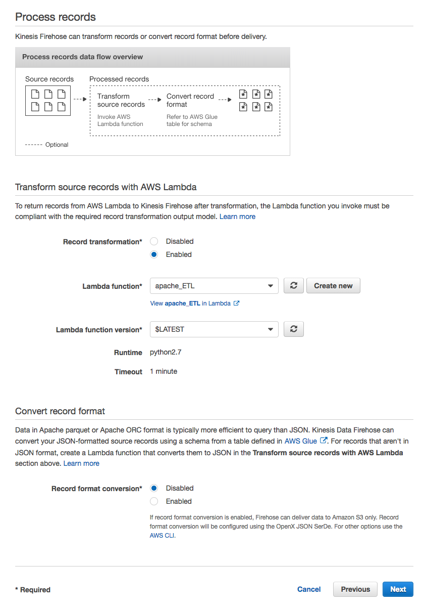
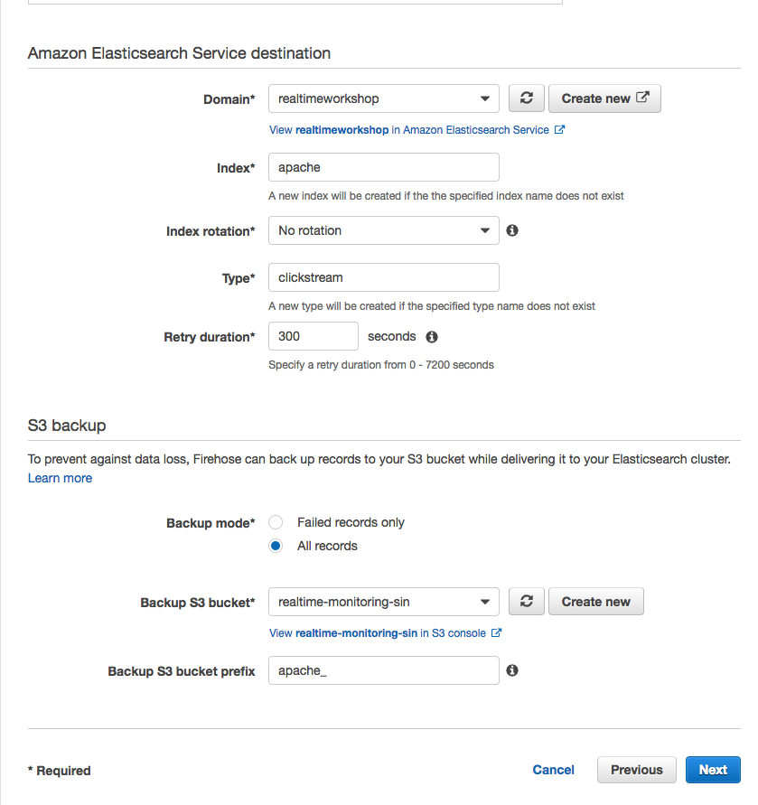
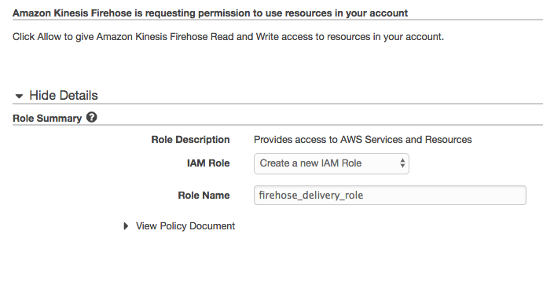
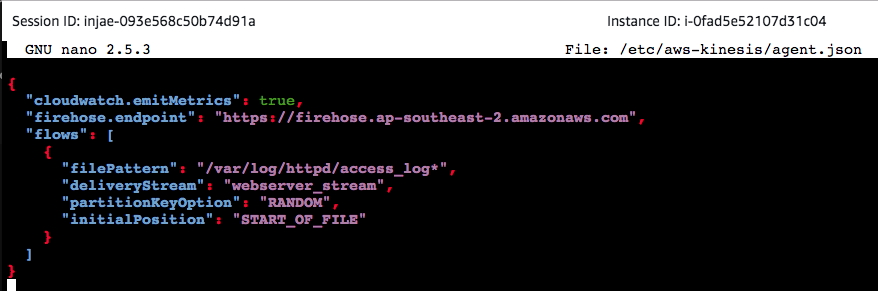
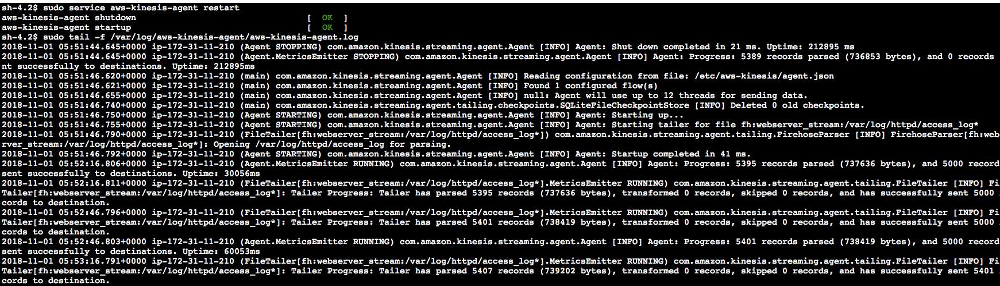
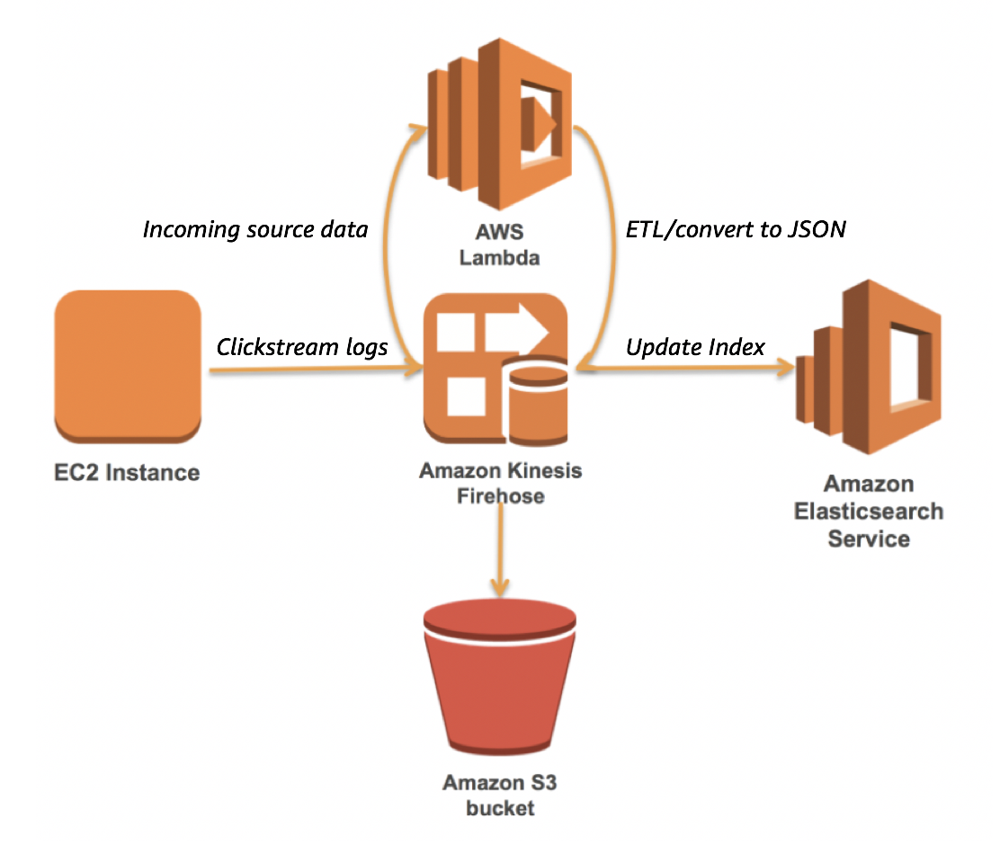
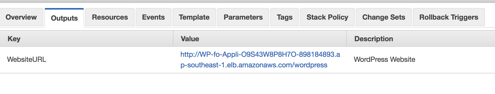
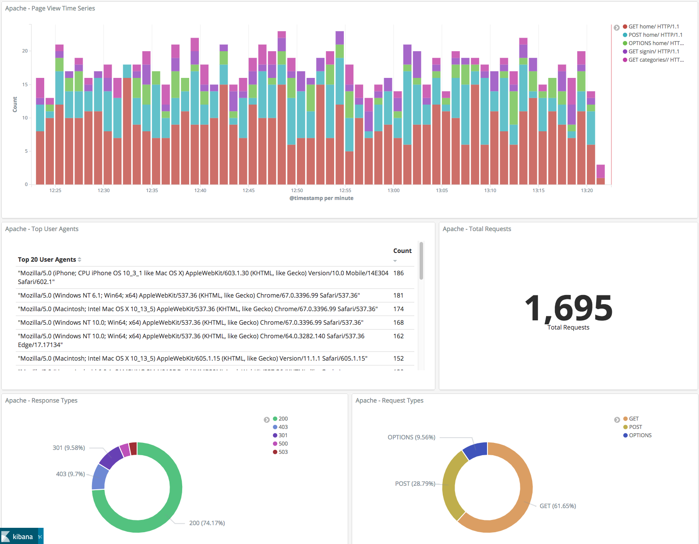

# Module 2: Clickstream Analysis for User Activity

# Introduction
In this Module, we will explore how we can surface clickstream logs within our Web Server to power a visualisation dashboard on Kibana. By collecting and analyzing these data, we can build up user behaviour profiles as they browse our unicorn store and derive insights on customer behaviour.

Through clickstream analysis and customer segmentation, we can start building a foundation to enable our Sales and Marketing team to better understand how visitors behave and immediately measure the impact of new customer campaigns on our web channel.

# Architecture


# Region
This workshop will use the Sydney region, but you can also use the following regions.

+ US East (N. Virginia) us-east-1
+ US West (Oregon) us-west-2
+ Asia Pacific (Sydney)	ap-southeast-2	
+ EU (Frankfurt) eu-central-1

# Ingesting Clickstream logs with Kinesis Firehose with Serverless ETL (Extract Transform Load)

## 1. Kinesis Firehose with Lambda transformation
As new visitors arrive to our website, our apache webserver captures each request in the form of clickstream logs. By capturing and ingesting these logs in real-time, we can create visibility on whats happening within our application and get valuable insights such as seeing the breakdown of requested pages by popularity, following the trail of page paths a visitor took and troubleshooting by tracking the number of 5XX HTTP responses back to the user. By using Amazon Kinesis Data Firehose for a fully managed data ingestion service, we can apply ETL on the fly with integration with AWS Lambda to transform our clickstream logs into an Elasticsearch compatible format, and continually deliver and update our Elasticsearch indexes.

We will first create the ETL Lambda function, which we will use later in our Kinesis Data Firehose.

<details>
<summary><strong>Creating an ETL Lambda Step-By-Step Instructions (expand for details)</strong></summary><p>

### Creating an ETL Lambda function

1. In the AWS Management Console select **Services** then select **Lambda** under Compute.

1. In the service console, select **Create a function**

1. In **Create function page**, select **Author from scratch**. Give your function a name such as `apache_ETL`.

1. For **Runtime**, select **Python 2.7**.

1. Under **IAM Role**, select **Create a custom role** to bring up a new IAM role creation page. 

1. Under IAM Role, use the drop down menu to select **Create a new IAM Role**, then enter a name such as `lambda_basic_execution_apache_ETL` . This will automatically generate the permissions required for our Lambda to run and write logs to CloudWatch.

1. Proceed to the next step by selecting **Allow**.

1. Back in create function page, proceed by selecting **Create function** at the bottom of the page.

1. Scroll down to the Code editing window and you'll see some sample code like below.

    ``` python
    import json

    def lambda_handler(event, context):
    # TODO implement
    return {
        "statusCode": 200,
        "body": json.dumps('Hello from Lambda!')
    }
    ```

1. Delete and replace the sample code with the following script. Have a look at the code and the comments to see what's happening to the incoming data before it is ETL'ed and put back into the Firehose stream.

    ``` python
    from __future__ import print_function
    import base64
    import json
    import re
    from dateutil.parser import parse
    from datetime import datetime, tzinfo, timedelta

    print('Loading function')


    class UTC(tzinfo):
        """UTC"""

        def utcoffset(self, dt):
            return timedelta(0)

        def tzname(self, dt):
            return "UTC"

        def dst(self, dt):
            return timedelta(0)

    utc = UTC()


    def lambda_handler(event, context):

        print ("This is the raw event: {}".format(event))
        output = []
        succeeded_record_cnt = 0
        failed_record_cnt = 0
        
        safe_string_to_int = lambda x: int(x) if x.isdigit() else x

        ## Because data in Kinesis is base64 encoded, we have to decode it before changing the output as a JSON document
        for record in event['records']:
            print(record['recordId'])
            payload = base64.b64decode(record['data'])
            payload = payload.decode("utf-8")
            print ("This is the payload: {}".format(payload)) 
            
            # check if clickstream log format else fall back to other log format
            regex = '^([\d.]+) (\S+) (\S+) \[([\w:\/]+)(\s[\+\-]\d{4}){0,1}\] "(.+?)" (\d{3}) (\d+) (".+?") (".+?") "user = ([^;]*)' 
            p = re.compile(regex)
            m = p.match(payload)
            
            if p.match(payload) is None: # log format doesnt have cookie data (username)
                regex = '^([\d.]+) (\S+) (\S+) \[([\w:/]+)(\s[\+\-]\d{4}){0,1}\] \"(.+?)\" (\d{3}) (\d+) (".+?") (".+?")'
                p = re.compile(regex)
                m = p.match(payload)
            
            if m:
                succeeded_record_cnt += 1

                ts = m.group(4)
                ## changing the timestamp format
                try:
                    d = parse(ts.replace(':', ' ', 1))
                    ts = d.isoformat()
                except:
                    print('Parsing the timestamp to date failed.')
                ## Creating our dictionary (hash map) using extracted values from our log file
                data_field = {
                    'host': m.group(1),
                    'ident': m.group(2),
                    'authuser': m.group(3),
                    '@timestamp': ts,
                    'request': m.group(6),
                    'response': safe_string_to_int(m.group(7)),
                    'bytes': safe_string_to_int(m.group(8)),
                    'referer': safe_string_to_int(m.group(9)),
                    'user-agent': safe_string_to_int(m.group(10))
                }
                ## Clickstream log, adding username from cookie field
                if (len(m.groups()) > 10):
                    data_field['username'] = safe_string_to_int(m.group(11))
        
                if m.group(6) and len(m.group(6).split()) > 1:
                    data_field['verb'] = m.group(6).split()[0]

                # If time offset is present, add the timezone and @timestamp_utc fields
                if m.group(5):
                    data_field['timezone'] = m.group(5).strip()
                    try:
                        ts_with_offset = m.group(4) + m.group(5)
                        d = parse(ts_with_offset.replace(':', ' ', 1))
                        utc_d = d.astimezone(utc)
                        data_field['@timestamp_utc'] = utc_d.isoformat()
                    except:
                        print('Calculating UTC time failed.')

                output_record = {
                    'recordId': record['recordId'],
                    'result': 'Ok',
                    'data': base64.b64encode(json.dumps(data_field))
                }
            else:
                print('Parsing failed')
                failed_record_cnt += 1
                output_record = {
                    'recordId': record['recordId'],
                    'result': 'ProcessingFailed',
                    'data': record['data']
                }

            output.append(output_record)
        
        ## This returns the transformed data back to Kinesis Data Firehose for delivery to our Elasticsearch domain
        print('Processing completed.  Successful records {}, Failed records {}.'.format(succeeded_record_cnt, failed_record_cnt))
        print ("This is the output: {}".format(output))
        return {'records': output}

    ```
1. After putting our new code in, scroll down and find a section called **Basic settings**. Increase the timeout from 3 seconds to 1 min to allow our lambda function to process the record transformation, reducing the risk of timing out before it is complete.

1. Finish creating the function by selecting **Save** at the top of the page.

</p></details>

## Creating a Kinesis Firehose
Now that our ETL Lambda has been created, let's create a new Kinesis Data Firehose that will use our Elasticsearch domain as the delivery destination.

<details>
<summary><strong>Creating a Kinesis Firehose to Elasticsearch Step-By-Step Instructions (expand for details)</strong></summary><p>

1. In the AWS Management Console select **Services** then select **Kinesis** under Analytics.

1. In the service console, select **Get started** and select **Create delivery stream** for the Kinesis Firehose wizard.

1. Under **New delivery stream**, give your Delivery stream name such as `webserver_stream`.

1. Under **Choose source**, verify that **Direct PUT or other sources** is selected. Although Kinesis Data Firehose can be configured to ingest data from a Kinesis Data stream (non-firehose), we will be using an agent to push into our Firehose stream.

1. Proceed to the next page by selecting **Next**.

1. In Step 2: Process records, enable **Record transformation** using the Lambda function we created previously (eg. apache_ETL).

1. Verify that Record format conversion is **Disabled** under **Convert record format**. If we wanted to deliver the data within Firehose for running analytics within Redshift or S3 (via Athena), this would be a great way to automatically transform the data into a columnar format such as Parquet for a more efficient file format for analytics.

    

1. Proceed to the next page by selecting **Next**.

1. Under **Select destination**, select **Amazon Elasticsearch Service** to view our existing domain.

1. Under **Amazon Elasticsearch Service destination**, select our existing cluster for **Domain**.

1. For **Index**, enter a name such as `apache`.

1. Select **No rotation** for index rotation frequency and enter a name for **Type** such as `clickstream`.

1. Under **S3 backup**, we can select whether a copy of the records from our Firehose is automatically backed up into an S3 bucket, or only for records that fails to be processed. For this workshop, select **All records** to view the data later on to have a look at the ingested data.

1. Create or use an existing S3 bucket and for **Backup S3 bucket prefix**, enter a name followed by underscore such as `apache_`. This will make it easier later on to identify which prefix our firehose backups the records into.

1. Your settings should look similar to this

    


1. Proceed to the next page by selecting **Next**.

1. In Step 4: Configure Settings, select a **Buffer size** of 1 MB and **Buffer interval** of 60 seconds. As Firehose automatically buffers and aggregates the data in the stream, it will wait until either of these conditions are met before triggering the delivery. If you need to ensure faster (lower) availability of data in the stream, Kinesis Data Stream allows a more immediate window.

1. For **S3 compression and encryption** check that the settings are set to **Disabled**, and for **Error logging**, ensure that it is **Enabled** for future troubleshooting if required.

1. Under IAM Role, use the drop down menu to select **Create a new IAM Role**, then enter a name such as `firehose_delivery_role_clickstream` . This will automatically generate the permissions required for our Firehose to use the configured settings for CloudWatch, S3, Lambda and ElasticSearch.

    

1. Proceed to the next step by selecting **Allow**.

1. Verify that the settings are configured as above, and finish the wizard by selecting **Create delivery stream**. This will take 5-7 min to complete creating the new stream.

</p></details>


## 2. Publishing Clickstream Logs via Kinesis Agent
To allow an easier way to parse, process and send the local log files in our web server into our Kinesis Firehose, we can use Kinesis Agent which is a stand-alone Java application to continually monitor a set of files for changes and push the data into the stream. 

For authentication and authorization for the Agent to interact with our Firehose stream, it requires a set of AWS Access Keys and Secret Keys with the appropriate resource permissions. For this workshop, our EC2 instance running our web server has an IAM role attached with this permission. With this, we don't need to hardcode our keys into the Kinesis Agent configuration file as it will automatically use the temporary credentials generated by the EC2's IAM role. [Click here](https://docs.aws.amazon.com/IAM/latest/UserGuide/id_roles_use_switch-role-ec2.html) to find out more about this process.

As of 6th Nov 2018, [Windows Kinesis Agent](https://github.com/awslabs/kinesis-agent-windows) is now available.

Let's go ahead and SSH into our webserver to install and configure the agent.

1. If you have an SSH client such as Putty on Windows or Terminal on Mac, use this to connect to your EC2 instance. If you don't have an SSH client, you can create a new session online through the AWS Console using the Systems Manager service.

    <details>
    <summary><strong>SSH session through Systems Manager (expand for details)</strong></summary><p>

    [Reference link](https://docs.aws.amazon.com/systems-manager/latest/userguide/session-manager-working-with-sessions-start.html)

    1. In the AWS Management Console select **Services** then select **Systems Manager** under Management Tools.

    1. In the service console, select **Session Manager** from the left hand panel and select **Start Session** to list target instances.

    1. You should be able to see our web server instance. Select the instance and open a new SSH session window by selecting **Start Session**.

    1. In the new SSH session, change to root user by entering sudo -s.
    </p></details>

<details>
<summary><strong>Installing and configuring Kinesis Agent (expand for details)</strong></summary><p>

1. Download and Install the [Kinesis Agent](https://docs.aws.amazon.com/streams/latest/dev/writing-with-agents.html) using the following command. As the EC2 instance has an attached IAM role, you can skip the pre-requisites referring to IAM or AWS credentials (the Agent will do this automatically) in the reference link.

    ```shell
    sudo yum install aws-kinesis-agent -y
    ```

1. Now we will configure the Kinesis Agent to use the Kinesis Firehose we created previously, and to parse the apache log file.

1. Verify if you have correct permissions to read the file by opening the file. If you see permission denied, you may have to use chmod to change the permission for the directory.

    ```shell
    tail /var/log/httpd/access_log
    ```

1. Change the permission for the httpd log directory for Kinesis Agent to parse apache logs with the following command.

    ```shell
    sudo chmod 777 -R /var/log/httpd/
    ```

1. Use your favourite editor (vim, nano, pico or Emacs if you're brave!) to open and edit the configuration file `/etc/aws-kinesis/agent.json`. Hint: You can delete lines at a time by 

    ```shell
    sudo nano /etc/aws-kinesis/agent.json
    ```

1. You can use the configuration syntax in the [Kinesis Agent documentation](https://docs.aws.amazon.com/streams/latest/dev/writing-with-agents.html#agent-config-settings) page, or use settings below.

    `Remember to change the values to your own resource names!`

    **firehose.endpoint:** Firehose regional endpoint

    **filePattern:** Path to our log file. Appending the wildcard will allow the Agent to pick up rotating log files (eg. when you accidently delete and create it again)

    **deliveryStream:** Friendly name of your Firehose (eg. webserver_stream)


    ```json
    {
        "cloudwatch.emitMetrics": true,
        "firehose.endpoint": "https://firehose.ap-southeast-2.amazonaws.com",
        "flows": [
            {
                "filePattern": "/var/log/httpd/access_log*",
                "deliveryStream": "<YOUR FIREHOSE NAME>",
                "partitionKeyOption": "RANDOM",
                "initialPosition": "START_OF_FILE"       
            }
        ]
    }
    ```

1. Save the file with ctrl+O (then enter), and exit by ctrl+X.

    *Example of config file*
    

1. Start the Kinesis Agent service with the following command.

    ```shell
    sudo service aws-kinesis-agent start
    aws-kinesis-agent startup                                  [  OK  ]
    ```

1. Now that the agent has started, we can observe the Agent log file to see if it picks up the apache request logs and send it to our Kinesis Firehose.

    ```shell
    tail -f /var/log/aws-kinesis-agent/aws-kinesis-agent.log
    ```

    

1. We can also observe the metrics for our Kinesis Data stream within the Monitoring section within the Kinesis console.

`Don't forget to edit your web ACL to remove the IP Block rule for WAF if you've completed Module 1`

</p></details>


# Using Kibana to visualize Clickstream logs
Now that our plumbing is in place, the workflow will look like this.



* Web Server logs incoming HTTP requests
* Kinesis Agent parses log file and push to Kinesis Firehose
* Lambda function ETLs the log data and puts transformed output into the stream
* Kinesis Firehose delivers the new document into Elasticsearch and update the Index

And now, let's test our new pipeline by generating some data!

After ensuring that the aws-kinesis-agent service is running, generate some sample logs by browsing our website. You can find the URL of our Wordpress website by looking at the Outputs section of the WP stack within CloudFormation.



If you would like to get a deeper look at what is happening at each stage in our pipeline, some recommendations are to tail the httpd access_log file, Kinesis Firehose Monitoring metrics and Lambda Function's CloudWatch logs.

Finally, you should be able to see the number of Index count increasing within your Elasticsearch under **Indices**.

## 1. Visualizing with Kibana
In this section, we will use the integrated Kibana dashboard to create a monitoring dashboard of our incoming HTTP requests.

<details>
<summary><strong>Creating Visuals with Kibana (expand for details)</strong></summary><p>

1. In the AWS Management Console select **Services** then select **Elasticsearch Service** under Analytics.

1. After selecting your ES instance, open the Kibana dashboard by opening the respective URL under **Overview**. If you get an access denied message, verify if your IP address is whitelisted under **Modify access policy**.

1. Within Kibana, select **Management** on the left hand panel.

1. Select **Index Patterns**, then **Create Index Pattern**. This will allow us to add our index for Kibana to use as a data source.

1. You should be able to see your Index name such as `apache`. Enter it in **Index pattern** and proceed via **Next Step**.

1. Under **Configure Settings**, use the drop down menu to select **@timestamp**. Back in our ETL Lambda function, we changed the timestamp format to be compatible with Kibana.

1. Finish the wizard by selecting **Create index pattern**. If it is successful, you should be able to see multiple Fields from the incoming data.

1. Take a moment to look at the streaming data by selecting **Discover** on the left hand panel.

1. If you don't see the requests that you generated previously on the website, use the **Auto-refresh** at the top of the page with 5 seconds interval to continually refresh the index.

1. Try creating your own visualisation from the Visualize menu on the left hand panel. For example, if you want to represent number of HTTP response codes:

+ Create a new **Pie** chart
+ Select your index that you added previously
+ Under Buckets, select **Split Slices**
+ Select the type **Terms** for Aggregation
+ Use **Field** to add **Response**
+ Apply changes to see the generated visual
+ If you only see 200 responses (from the Load Balancer health check requests), try generating some 404 response by requesting non-existing URL paths on your website.

</p></details>

## 2. Generating Sample Clickstream Data
To generate clickstream logs that simulate our online unicorn shop, your Wordpress EC2 instance has a python script that can generate sample data into the httpd access_log file.

The script is located under `/home/ec2-user/module2/clickstream.py` and can be continually run using the `produce.sh` script.

Below are examples of the generated log entries.

```shell
122.57.114.224 - - [30/Oct/2018:05:52:25 +0000] GET home/ HTTP/1.1 200 5708 www.unicornshop.com/products// Mozilla/5.0 (iPad; CPU OS 8_4_1 like Mac OS X) AppleWebKit/600.1.4 (KHTML, like Gecko) Version/8.0 Mobile/12H321 Safari/600.1.4 user = anonymous; PHPSESSID=93fc9aaa09a740c69e64af0e9127f261

187.1.116.45 - - [30/Oct/2018:05:52:27 +0000] GET categories// HTTP/1.1 500 44439 www.unicornshop.com/home/ Mozilla/5.0 (Linux; U; Android-4.0.3; en-us; Galaxy Nexus Build/IML74K) AppleWebKit/535.7 (KHTML, like Gecko) CrMo/16.0.912.75 Mobile Safari/535.7 user = siskinstemson; PHPSESSID=ac20fe8d26d4463e9fdee50a82829a58
```

<details>
<summary><strong>Using clickstream log generating script (expand for details)</strong></summary><p>

1. SSH into your Wordpress instance
1. Change into the working directory 

    ```shell
    [ec2-user@ip-172-31-11-210 ~]$ cd /home/ec2-user/module2
    [ec2-user@ip-172-31-11-210 module2]$ ls
    clickstream.py  produce.sh
    ```

1. Run the shell script, which will continually invoke the python script in a loop.

    ```shell
    [ec2-user@ip-172-31-11-210 module2]$ sudo chmod +x produce.sh
    [ec2-user@ip-172-31-11-210 module2]$ . produce.sh 
    Generating new clickstream log at /var/log/httpd/access_log
    Press [CTRL+C] to stop..
    Generating new clickstream log at /var/log/httpd/access_log
    Press [CTRL+C] to stop..
    ```

    ```shell
    [ec2-user@ip-172-31-11-210 module2]$ tail -f /var/log/httpd/access_log 

    162.250.88.82 - - [03/Nov/2018:04:29:26 +0000] "POST home/ HTTP/1.1" 200 20494 "www.unicornshop.com/categories//" "Mozilla/5.0 (Linux; U; Android-4.0.3; en-us; Galaxy Nexus Build/IML74K) AppleWebKit/535.7 (KHTML, like Gecko) CrMo/16.0.912.75 Mobile Safari/535.7" "user = anonymous; PHPSESSID=903f966790f4452e8b695267efe93a99"
    187.74.103.143 - - [03/Nov/2018:04:29:29 +0000] "GET products/Meeqeos/ HTTP/1.1" 403 37679 "www.unicornshop.com/home/" "Mozilla/5.0 (iPhone; CPU iPhone OS 10_3_1 like Mac OS X) AppleWebKit/603.1.30 (KHTML, like Gecko) Version/10.0 Mobile/14E304 Safari/602.1" "user = anonymous; PHPSESSID=2ef5dd310f9c4a2781a9145d190909d5"
    172.31.4.149 - - [03/Nov/2018:04:29:31 +0000] "GET /wordpress/ HTTP/1.1" 200 55172 "-" "ELB-HealthChecker/2.0"
    ```

1. Whilst the script is running, have a look at your Kibana to see the incoming new data in the **Discover** page.

`For this workshop, it's recommended to change the Time Range to a smaller window such as Last 1 hour`

</p></details>

## 3. Creating a Clickstream Dashboard on Kibana
Try creating your own visuals using the newly added Index containing the clickstream sample data.

Alternatively, you can import a dashboard template to see a working example. `Note: Import may fail if you have named your domain and Indexes different to the example names above`

1. Open your Kibana instance and select **Management** located on the left hand panel.

1. Open **Saved Objects** page, then use the **Import** to upload the `clickstream_kibana.json` file (a copy of it is saved in the scripts dir in the git repo).

1. If prompted to Automatically overwrite all saved objects? Select **Yes, overwrite all objects**.

1. If you have named your Index other than `apache`, you may be prompted to replace *Apache* with your own clickstream Index name.

1. If successful, you should see a new Dashboard under Saved Objects. Click the imported dashboard and select **View dashboard**.

    *Example*

    

# [Optional Lab] - Analyzing Clickstream data with Amazon Glue and Amazon Athena

As we have a copy of the clickstream data being saved in our S3 bucket (as configured in Kinesis Data Firehose), this is a great starting point for building up a data lake. Try using Amazon Glue's crawler to discover the schema for our data in S3, then use Athena to run SQL queries on the Glue hive tables.

In real world use cases, this can help complement existing Data Warehouses such as Redshift for heavier offline processing and analysis of your data.

Below are some references to help get started.
https://docs.aws.amazon.com/athena/latest/ug/glue-athena.html
https://docs.aws.amazon.com/athena/latest/ug/getting-started.html
https://aws.amazon.com/blogs/big-data/build-a-data-lake-foundation-with-aws-glue-and-amazon-s3/
https://docs.aws.amazon.com/athena/latest/ug/ctas.html


# Other Applications of Clickstream Analysis Data

In this Module, we covered how we can start exploring our data through building visualisation. Although this is a great first step in understanding our data and gaining insights, you can also leverage other downstream applications such as Machine Learning or other forms of analytics such as Data Warehousing or something more real-time to power upstream platforms and applications.


# Troubleshooting FAQs

Q. I can't see clickstream logs being published to Kinesis Firehose via the Kinesis Agent
A. Verify if your Agent config file is set to use your Firehose's delivery name, and the Agent service is running. You can also view the Agent log with `tail /var/log/aws-kinesis-agent/aws-kinesis-agent.log` to see if records are being successfully delivered.

Q. I can't see clickstream data arriving in my Elasticsearch domain.
A. Use the architecture diagram to see where the data flow is stalling in the pipeline.

- For Kinesis, verify if the logs are arriving by using the built in metrics to see changes.
- For verifying data integrity, download and view a copy of the data in your S3 bucket (as configured in Kinesis)
- For verifying data delivery, use the Indices tab in Elasticsearch to see if the Index counters are incrementing
- Verify that you have added a new Index Pattern within Kibana for the new data
- For verifying data within the Kibana Index, try adjusting the time range at the top right, from default 15min to 7 days.

