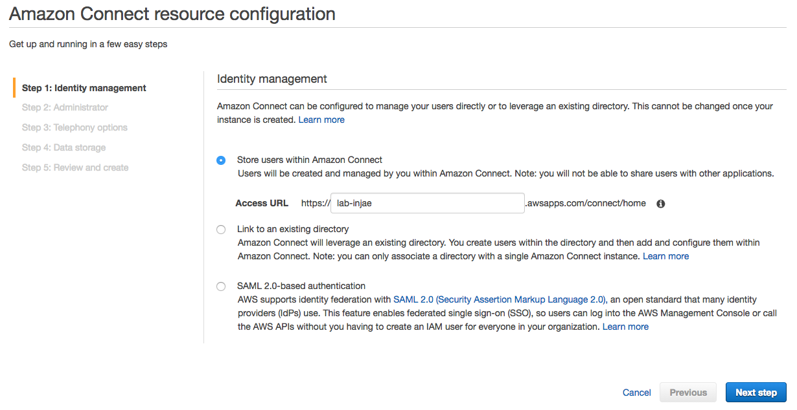
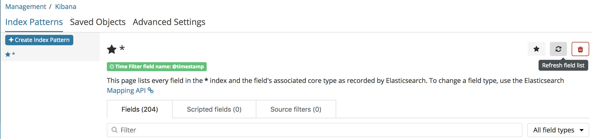
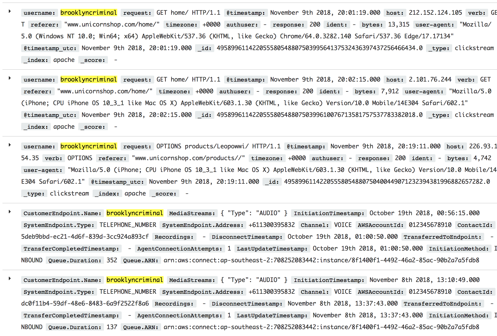

# Module 3. Augmenting User Behaviour Profiles with Contact Centre Data

# Introduction
In this module, we will explore how we can take an another customer channel such as calls in our contact centre and use it to enrich the customer segementation data that we've gathered through clickstream analysis. By aggregating these different data sets, we can start better understanding how a customer interacts with the business and work towards an omni-channel user experience and analysis for better business outcomes.

# Architecture 


# Region
This workshop will use the Sydney region, but you can also use the following regions.

+ US East (N. Virginia) us-east-1
+ US West (Oregon) us-west-2
+ Asia Pacific (Sydney)	ap-southeast-2	
+ EU (Frankfurt) eu-central-1

## Pre-requisites
A number of components from modules 1 and 2 will be used in this module. Specifically:
- The Amazon Elasticsearch Cluster
- The Wordpress EC2 instance

# Generating contact records with Amazon Connect

## Creating an Amazon Connect Instance
To begin, we need to provision an Amazon Connect instance. Once provisioned, you can edit the settings for it, which include telephony, data storage, data streaming, application integration, and contact flows. 

#### High-Level Instructions
Use the console or AWS CLI to provision Amazon Connect. 

<details>
<summary><strong>Creating Amazon Connect Step-by-step instructions (expand for details)</strong></summary><p>

1. In the AWS Management Console select **Services** then select **Amazon Connect** under Customer Engagement.

1. Select **Get started**.

1. In **Step 1: Identity management**, select **Store users within Amazon Connect** and give your Connect a name. For this workshop, we will use the built-in user pool within Amazon Connect, but you can also integrate with existing identities such as AWS Managed Microsoft AD or your own IdP via SAML.

  

  ---
  **NOTE**

  The name that you enter is displayed as the instance alias in the AWS Management Console, and is used as the domain in the access URL to access your contact centre. The alias must be globally unique, meaning that an alias can be used only one time across all Amazon Connect instances and Regions. 

  ---

1. For **Step 2: Administrator** choose **Skip this** to create an admin account later.

1. For **Step 3: Telephony options** choose to both accept and make calls.

1. For **Step 4: Data storage** keep the default settings.

1. For **Step 5: Review and create**, review your settings and create your Connect environment by selecting **Create instance**.

1. After your instance is created, choose **Get started** and select **Let's Go** to configure Connect. 

1. Claim a new Australian Toll Free number using below and select **Next**. Try testing the new number by making a call.

  + **Country**: Australia
  + **Type**: Toll Free
  + **Phone Number**: Select one from the drop down box
  
  ---
  **NOTE**

  If you get an error when clicking **Get started**, wait a few minutes and try again. It can take a few minutes for the instance to complete the provisioning process. 

  ---

<h3>[Optional] Customize Your Contact Flow</h3>
Try creating your own customized contact flow using [Reference](https://docs.aws.amazon.com/connect/latest/userguide/contactflow.html) to simulate DTMF menus and [Amazon Lex integration for NLP chatbot](https://aws.amazon.com/blogs/contact-center/amazon-connect-with-amazon-lex-press-or-say-input/)


</p></details>

# Serverless ETL for Contact Records with Lambda
As we stream our Contact Trace Records from Amazon Connect to Elasticsearch via Kinesis, we need to transform the records to look up the incoming phone number and append the caller name to the record. The transformation will be performed by a Lambda function that will be invoked by Kinesis Firehose to trasform incoming data.

#### High-Level Instructions
Use the console or AWS CLI to create a python Lambda function from the kinesis-firehose-process-record-python blueprint. The required code to perform the transformation is in the step-by-step instructions below. 

<details>
<summary><strong>Creating a new ETL Lambda Step-by-step instructions (expand for details)</strong></summary><p>

1. In the AWS Management Console select **Services** then select **Lambda** under Compute.

1. In the service console, select **Create a function**

1. In **Create function page**, select **Author from scratch**. Give your function a name such as `connect_ETL`.

1. For **Runtime**, select **Python 2.7**.

1. Under **Role**, select **Create a custom role** to bring up a new IAM role creation page. Ensure that **Create a new IAM Role** is selected and proceed to the next step by selecting **Allow**. This will automatically generate a new IAM role with just enough permissions scoped to allow our Lambda function to extract data from our Kinesis and update the Elasticsearch index.

1. Back in create function page, proceed by selecting **Create function** at the bottom of the page.

1. Under the **Function code** section, replace the existing code with the code below. 

```python
from __future__ import print_function
import base64
import json
from botocore.vendored import requests

print('Loading function')


def lambda_handler(event, context):
    output = []
    endpoint = "https://b504u2ytqg.execute-api.ap-southeast-2.amazonaws.com/api/user/" # if you'd like to deploy your own endpoint, use the app.py file in the repo's script directory to deploy through the Chalice framework

    for record in event['records']:
        payload = base64.b64decode(record['data'])
        
        # Do custom processing on the payload here

        jsonPayload = json.loads(payload)
        phoneNo = jsonPayload["CustomerEndpoint"]["Address"]
        
        response = requests.get(endpoint + phoneNo)
        jsonPayload["CustomerEndpoint"]["Name"] = response.text

        # adding new timestamp field to join with other Indexes in Kibana
        jsonPayload["@timestamp"] = jsonPayload["ConnectedToSystemTimestamp"].replace("Z","")

        stringPayload = json.dumps(jsonPayload)
        print(stringPayload)

        output_record = {
            'recordId': record['recordId'],
            'result': 'Ok',
            'data': base64.b64encode(stringPayload)
        }
        output.append(output_record)

    print('Successfully processed {} records.'.format(len(event['records'])))

    return {'records': output}
```

1. Under **Basic Settings**, change the timeout to `1 minute`

1. In the top right hand corner, select **Save**.

1. To test that the Lambda function is operating correctly, select the dropdown box next to the **Test** button and select **Configure test events**.

1. Select **Create new test event** and select **Amazon Kinesis Data Firehose** from the **Event template** dropdown box.

1. Under **Event name** add `AddNameTest`.

1. Replace the existing JSON with the following:

  ```JSON
  {
    "invocationId": "invocationIdExample",
    "deliveryStreamArn": "arn:aws:kinesis:EXAMPLE",
    "region": "ap-southeast-2",
    "records": [
      {
        "recordId": "49546986683135544286507457936321625675700192471156785154",
        "approximateArrivalTimestamp": 1495072949453,
        "data": "eyJBV1NBY2NvdW50SWQiOiI0Njc3NTEyNzQyNTYiLCJBV1NDb250YWN0VHJhY2VSZWNvcmRGb3JtYXRWZXJzaW9uIjoiMjAxNy0wMy0xMCIsIkFnZW50IjpudWxsLCJBZ2VudENvbm5lY3Rpb25BdHRlbXB0cyI6MCwiQXR0cmlidXRlcyI6eyJncmVldGluZ1BsYXllZCI6InRydWUifSwiQ2hhbm5lbCI6IlZPSUNFIiwiQ29ubmVjdGVkVG9TeXN0ZW1UaW1lc3RhbXAiOiIyMDE4LTExLTAyVDA3OjAwOjEyWiIsIkNvbnRhY3RJZCI6ImM1NGQ3YjNhLTU4MWQtNDVjZS05YTNjLWU0Y2JiNjJlY2EzZiIsIkN1c3RvbWVyRW5kcG9pbnQiOnsiQWRkcmVzcyI6Iis2MTQwMTAwNDg1NCIsIlR5cGUiOiJURUxFUEhPTkVfTlVNQkVSIn0sIkRpc2Nvbm5lY3RUaW1lc3RhbXAiOiIyMDE4LTExLTAyVDA3OjAxOjA0WiIsIkluaXRpYWxDb250YWN0SWQiOm51bGwsIkluaXRpYXRpb25NZXRob2QiOiJJTkJPVU5EIiwiSW5pdGlhdGlvblRpbWVzdGFtcCI6IjIwMTgtMTEtMDJUMDc6MDA6MTJaIiwiSW5zdGFuY2VBUk4iOiJhcm46YXdzOmNvbm5lY3Q6YXAtc291dGhlYXN0LTI6NDY3NzUxMjc0MjU2Omluc3RhbmNlLzVhMmYzYjY4LTI0ZDctNDZjNS1iYTcwLWI3MGNkNjkxODI4NiIsIkxhc3RVcGRhdGVUaW1lc3RhbXAiOiIyMDE4LTExLTAyVDA3OjAyOjExWiIsIk1lZGlhU3RyZWFtcyI6W3siVHlwZSI6IkFVRElPIn1dLCJOZXh0Q29udGFjdElkIjpudWxsLCJQcmV2aW91c0NvbnRhY3RJZCI6bnVsbCwiUXVldWUiOnsiQVJOIjoiYXJuOmF3czpjb25uZWN0OmFwLXNvdXRoZWFzdC0yOjQ2Nzc1MTI3NDI1NjppbnN0YW5jZS81YTJmM2I2OC0yNGQ3LTQ2YzUtYmE3MC1iNzBjZDY5MTgyODYvcXVldWUvODk0ZDlhYzAtZDAxOC00MGYxLWE3YTItNzA4MTRkMDhhZDZhIiwiRGVxdWV1ZVRpbWVzdGFtcCI6IjIwMTgtMTEtMDJUMDc6MDE6MDRaIiwiRHVyYXRpb24iOjM5LCJFbnF1ZXVlVGltZXN0YW1wIjoiMjAxOC0xMS0wMlQwNzowMDoyNVoiLCJOYW1lIjoiQmFzaWNRdWV1ZSJ9LCJSZWNvcmRpbmciOm51bGwsIlJlY29yZGluZ3MiOm51bGwsIlN5c3RlbUVuZHBvaW50Ijp7IkFkZHJlc3MiOiIrNjExODAwNTMxNTIwIiwiVHlwZSI6IlRFTEVQSE9ORV9OVU1CRVIifSwiVHJhbnNmZXJDb21wbGV0ZWRUaW1lc3RhbXAiOm51bGwsIlRyYW5zZmVycmVkVG9FbmRwb2ludCI6bnVsbH0K"
      }
    ]
  }
  ```

  ---
  **NOTE**

  The data in the above records may seem garbled at first, but it is a base64 encoded copy of the original cleartext. This is due to the way the kinesis put-record operation uses Base64 encoding to allow you to send binary data. If you use a Base64 decoder (for example, https://www.base64decode.org/) to manually decode the data, you will see that it is, in fact, a sample Contact Trace Record. 

  ---

1. Select **Create**.

1. Ensure that **AddNameTest** is selected from the dropdown box and select the button, **Test**.

1. If sucessful, you should see a new window showing that your Lambda has been executed with the standard output in Log output window.

  

</details>

# Ingesting Amazon Connect call records with Kinesis Firehose
Now that we have our call centre provisioned, we need to add create a Kinesis Firehose Delivery stream to collect and transform Contact Trace Records, then deliver the records to our Elasticsearch cluster.

#### High-Level Instructions
Use the console or AWS CLI to create a Kinesis Firehose stream to transform your records with the previously created lambda function, and deliver records to your existing Elasticsearch cluster. Once created, stream Contact Trace Records from your Amazon Connect instance to Kinesis Firehose.

<details>
<summary><strong>Creating a Kinesis Firehose Stream for Connect Step-by-step instructions (expand for details)</strong></summary><p>

1. In the AWS Management Console select **Services** then select **Kinesis** under Analytics.

1. In the service console, select **Get started** and select **Create delivery stream** for the Kinesis Firehose wizard.

1. Under **New delivery stream**, give your Delivery stream name such as `CTRFHStream`.

1. Under **Choose source**, verify that **Direct PUT or other sources** is selected. Although Kinesis Data Firehose can be configured to ingest data from a Kinesis Data stream (non-firehose), we will be using an agent to push into our Firehose stream.

1. Proceed to the next page by selecting **Next**.

1. In Step 2: Process records, enable **Record transformation** using the Lambda function we created previously (eg. `connect_ETL`).

1. Verify that Record format conversion is **Disabled** under **Convert record format**. If we wanted to deliver the data within Firehose for running analytics within Redshift or S3 (via Athena), this would be a great way to automatically transform the data into a columnar format such as Parquet for a more efficient file format for analytics.

1. Proceed to the next page by selecting **Next**.

1. On the **Choose destination** page, enter values for the following fields:

  + Under **Destination** choose **Amazon Elasticsearch Service**.
  + Under **Domain** choose the Amazon ES domain created in the previous module.
  + Under **Index** enter `connect`.
  + Under **Index rotation** choose **No rotation**.
  + Under **Type** enter `CTR`
  + Under **Retry duration** enter 1
  + Under **Backup mode** choose **All Records**.
  + Under **Backup S3 Bucket** choose **Create New** and enter an S3 bucket name. Note that this must be unique across all s3 buckets globally. Select **Create S3 bucket**
  + Under **Backup S3 bucket prefix**, use a name such as `connect_` to help identify our records later if required.
  + Select **Next** to go to the Configure settings page.

1. On the **Configure settings** page, provide values for the following fields:
  + Under **Buffer size** choose `1MB`
  + Under **Buffer Interval** choose `60 seconds`
  + Under **S3 compression** choose **Disabled**
  + Under **s3 encryption** choose **Disabled**
  + Under **Error logging** choose **Enabled**
  + Under **IAM role** click **Create new or choose** and select the default by clicking **Allow** in the bottom right corner of the IAM Management window.

1. Click **Next** then review the settings and choose **Create Delivery Stream**.

The new Kinesis Data Firehose delivery stream takes a few moments in the creating state before it is available. After your Kinesis Data Firehose delivery stream is in an active state, you can start sending data to it from your producer (Amazon Connect).

</details>

# Delivering Contact Trace Records (CTR) to Elasticsearch via Kinesis Firehose
Now that our Kinesis Firehose delivery stream has been configured, we need to configure Amazon Connect to send Contact Trace Records to our stream to be delivered to Elasticsearch.

#### High-Level Instructions
Configure Amazon Connect to send its CTRs to the Kinesis Firehose delivery stream created in the previous step. Once complete, call your call centre and observe the call details in Elasticsearch.

<details>
<summary><strong>Step-by-step instructions (expand for details)</strong></summary><p>

1. In the AWS Management Console select **Services** then select **Amazon Connect** under Customer Engagement.

1. Select your instance under **Instance Alias** to make changes.

1. In the navigation pane, choose **Data streaming**.

1. Choose **Enable data streaming** to expand the menu. This is where we'll integrate our Kinesis Firehose for the Connect service to deliver our call records.

1. Select **Kinesis Firehose**, and then select the Kinesis Firehose stream created in the previous step in the drop-down list.

1. Select **Save** to update your Connect instance. Once complete, you shoudl see `Successfully edited settings`.

</details>

# Testing delivery of Call Trace Records to Elasticsearch
Now that we have our plumbing in place, the Call Trace Records from Connect should be delivered directly to Elasticsearch when we call into our call centre. 

#### High-Level Instructions
Call the Amazon Connect call centre you set up in step 1, and observe the Kinesis and Lambda metrics in CloudWatch. View the call records appearing in Elasticsearch.

`If you don't remember your claimed number, you can log into Connect as the administrator from the Overview tab in the left hand menu within your Connect instance, then View phone numbers in the main page`

<details>
<summary><strong>Testing CTR Delivery from Amazon Connect Step-by-step instructions (expand for details)</strong></summary><p>

1. Call your Amazon Connect call centre created in the first step and navigate the tone driven menu. After hanging up, navigate to CloudWatch and view the Kinesis and your ETL Lambda' CloudWatch log group to ensure record has been recieved, transformed and delivered.

  ---
  **NOTE**

  It may take ~60 seconds for Elasticsearch to show metrics as Kinesis Firehose batches by 1MB or 60sec batches. 

  ---

1. To view the appropriate logs in Cloudwatch, select **Services** then select **CloudWatch** under Management Tools.

1. In the navigation pane, choose **Metrics**.

1. Select the **Firehose** or **Lambda** metric.

1. Select a metric dimension to view. To view if the record has arrived in the stream, view the 
**PutRecord.Requests** dimension. To view if the Lambda function has been invoked, view the **Invocations** dimension. Multiple dimesions from multiple metrics can be selected. A list of metrics that can be observed can be found here:

    + Lambda Metrics: https://docs.aws.amazon.com/lambda/latest/dg/monitoring-functions-metrics.html
    + Firehose Metrics: https://docs.aws.amazon.com/firehose/latest/dev/monitoring-with-cloudwatch-metrics.html

1. Now that we can see that data is flowing through our pipeline, let's go to Kibana and add the new Index.

1. Within Kibana from your Elasticsearch cluster, click on **Management** on the left side of the page, then click **Create Index Pattern**. 

1. For the name of the index pattern, select `Connect` then click **Next step**.

1. Select **@timestamp** and from the **Time Filter field name** dropdown box and select **Create index pattern**. This will use the same timestamp field as the other Indexes to sort by date later on.

1. To verify that your Index was created successfully, navigate to **Discover** on the left side of the page and select the `Connect` index from the drop down filter menu. 

1. Because we are unable to easily generate large call volumes (unless you like dialling), a simulation script has been provided for you to send dummy CTRs to Kinesis. To run this script, perform the following:

    + SSH into your Wordpress EC2 instance
    + Change to the working directory with the following command
    
    ``` shell
    cd /home/ec2-user/module3
    ```

1. Open the amazonconnect.py script and change the value for the variable `firehoseName` with the name of your Kinesis Firehose name.

    ``` shell
    sudo nano amazonconnect.py
    ```

    ``` python
    # change value for firehoseName with your Connect stream's name e.g. CTRFHStream
    region = "ap-southeast-2"
    firehoseName = "<YOUR_CONNECT_STREAM>"
    ```

1. Save the file with ctrl+O (then enter), and exit by ctrl+X.

1. Run the simulation script `produce_connect.sh`. This will generate call record logs using a random timestamp within 7 days of current time and include information such as phone number, username (retrieved via our 'CRM' API), call queue type and the name of the connected agent.
    
    ``` shell
    sudo chmod +x produce_connect.sh
    . produce_connect.sh
    ```

1. If successful, you should be able to see an output similar to below. This means that the random call record log has been generated and published to the Kinesis Firehose using the AWS Python SDK.

    

1.  Navigate back to kibana and ensure the records are streaming in under **Discover**.

`If you don't see the script generated records in your Index within Kibana, try refreshing the field list within Management -> Index Patterns, and adjusting the Time Range for 7 week`

  

</details>

# Visualising Data in Kibana

## 1. Visualizing Contact Trace Records (CTR) call metrics

Now that the data is being sent to Elasticsearch, it's time to create a simple visualisation to gain insights into the collected data. 

#### High-Level Instructions
Create a visualisation that displays the number of calls received by Amazon Connect per day.

<details>
<summary><strong>Visualising Call Centre Data with Step-by-step instructions (expand for details)</strong></summary><p>

1. From the left-hand navigation menu, choose **Visualize**.

1. Click the “+” symbol to create a new visualisation.

1. Under **Data**, choose **Data Table**.

1. Select `connect*` from **Select Index**.

1. Under **Metrics**, expand **Metrics** and provide the following parameters:
  + **Aggregation:** Unique Count
  + **Field:** ContactId.keyword
  + **Custom Label:** Calls

1. Under **Buckets**, choose **Split Rows** and provide the following parameters:
  + **Aggregation:** Date Histogram
  + **Field:** @timestamp
  + **Interval:** Hourly
  + **Custom Label:** Calls per hour

1. Verify that the **Time Range** on the top right corner is set to **Last 7 days**.

1. To apply changes, choose the **Play** button.

1. From the top ribbon menu, choose **Save**.

1. Give your visualisation a name and choose **Save**.

</details>

## 2. Combining Clickstream and CTR data for user behaviour profile

Although we have created 3 x different Index patterns for WAF logs, Clickstream logs and CTR logs respectively, we can combine them together in Elasticsearch to create an aggregated data set.
By doing this, we can get a single pane view on how our customer behaved on our website, as well as any previous calls that they have made.

Combining different customer channels can be a powerful tool as it can help build a much more robust picture of a customer by providing insights on how they interact across our channels.

<details>
<summary><strong>Aggregating Data sources with Step-by-step instructions (expand for details)</strong></summary><p>

1. Within Kibana, use the **Management** tab and select **Index Patterns**.

1. You should be able to see 3 x existing Indexes. Let's create our 4th aggregate Index by selecting **Create Index Pattern**.

1. For index pattern, use `*` (wildcard) to match all existing indexes.

1. For the **Time Filter** name, use the drop down menu for **@timestamp**.

1. Finish creating the Index by selecting **Create Index Pattern**.

1. Back in the **Discover** tab, try searching for a username such as `brooklyncriminal` to retrieve all history across clickstream and call histories.

  

1. If you create a Dashboard, you can also filter by username or phone number to only show relevant Visuals.

</details>

# Other Applications of Data aggregation (or building a data lake)
By being able to join different data sets together using a common field (eg. username, timestamp), we can gain additional insights into the behaviour of our customers and group similar profiles together. Through this mechanism, we can enable business outcomes such as targeted marketing, recommendation engines (collaborative filtering) to identifying topics to train our staff upon if we see a heavy bias towards a particular area.

If we were to add additional sources of data such as customer purchase or sales history or an ERP system containing Inventory count into a real time data pipeline, this can unlock further business outcomes or identify new opportunities by correlation and discovering trends in the aggregate. 

For the curious, below are some additonal self-paced labs on building your first data pipeline, data lake and data warehousing:

- https://github.com/aws-samples/serverless-data-analytics
- https://dataprocessing.wildrydes.com/
