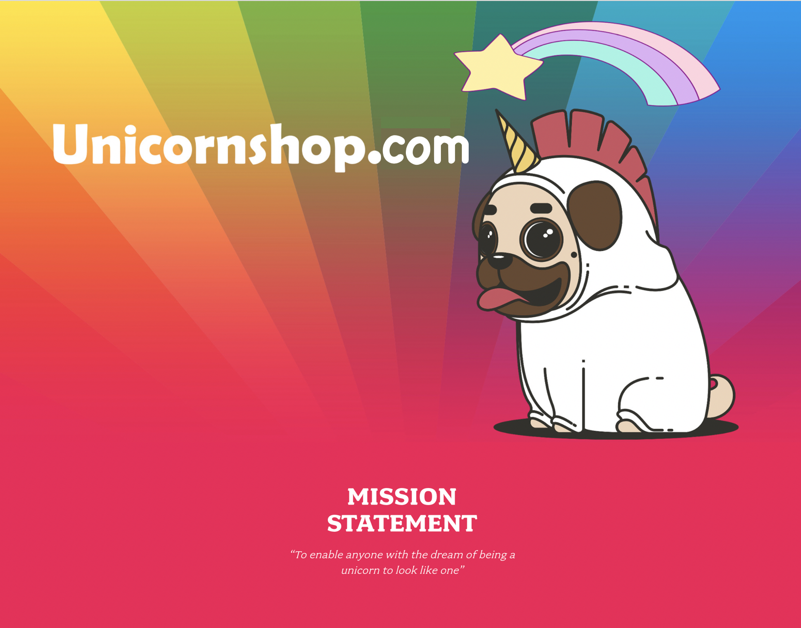

# Building A Real-Time Data Platform on AWS

<h3>
Following a viral marketing campaign, an unprecedented surge of traffic led to a 12 hour outage of our Unicornshop online store. 
</h3>

After quickly increasing our capacity in our AWS environment, our CTO has mandated a better understanding of our infrastructure with a monitoring solution.

In addition, the VP of Sales and Marketing has decided on a new data strategy to win back customers through better understanding of how visitors behave across different channels.

Your mission, should you choose to accept it, is to create a real-time data platform to enable these outcomes for our unicorn business! 🦄🦄🦄 

# Workshops
This is a self-paced level 200 workshop designed to allow you to get hands on with building a real-time data platform using serverless technologies such as Kinesis Firehose, AWS Lambda and Amazon Elasticsearch.

+ [Module-1_Monitoring_For_Operations](https://github.com/saltysoup/Building-a-real-time-data-platform-on-AWS/tree/master/Module-1_Monitoring_For_Operations) - This module shows you how you can start monitoring your infrastructure using a real-time dashboard to view the operational status of your fleet. You'll learn how to use CloudWatch Agent and CloudWatch Dashboard, as well as a [EKK](https://aws.amazon.com/blogs/devops/from-elk-stack-to-ekk-aggregating-and-analyzing-apache-logs-with-amazon-elasticsearch-service-amazon-kinesis-and-kibana/) stack composed of Elasticsearch, Amazon Kinesis and Kibana.

+ [Module-2_Clickstream_Analysis_For_User_Activity](https://github.com/saltysoup/Building-a-real-time-data-platform-on-AWS/tree/master/Module-2_Clickstream_Analysis_For_User_Activity) - This module demonstrates how you can collect, store and analyze clickstream logs to build a real-time dashboard of how users interact with your website, and build a user profile based on browsing history. You'll learn how to use the Kinesis Agent to publish apache logs and use AWS Lambda for serverless ETL in the EKK stack.

+ [Module-3_Contact_Centre_Data_Augmentation](https://github.com/saltysoup/Building-a-real-time-data-platform-on-AWS/tree/master/Module-3_Contact_Centre_Data_Augmentation) - This module shows you how to use an alternative customer channel such as a call center, to enrich the user profile data we've built up in Module 2's clickstream analysis. You'll learn how to configure Amazon Connect and ingest call metrics data to aggregate with the clickstream logs in Elasticsearch.

## License Summary

This sample code is made available under a modified MIT license. See the LICENSE file.
